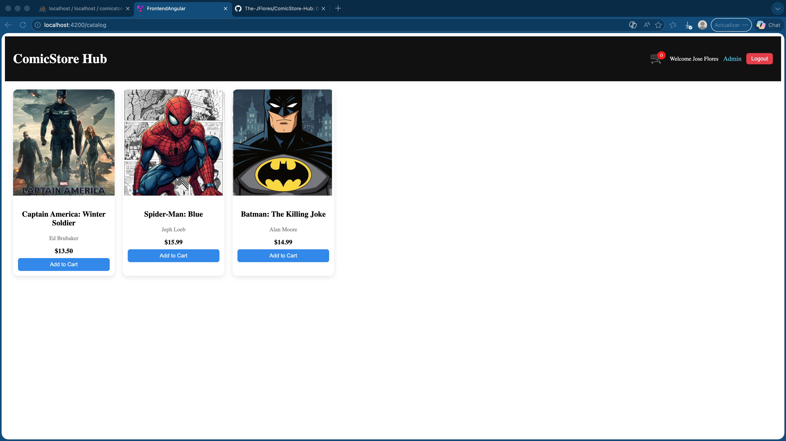
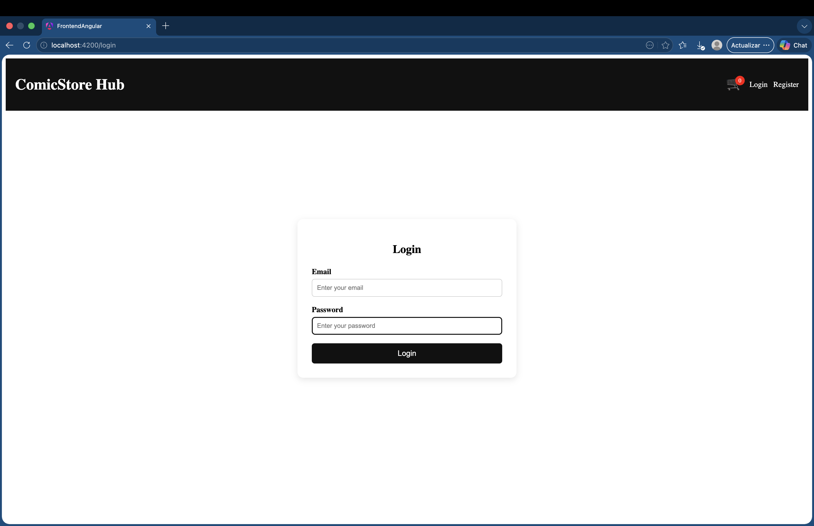
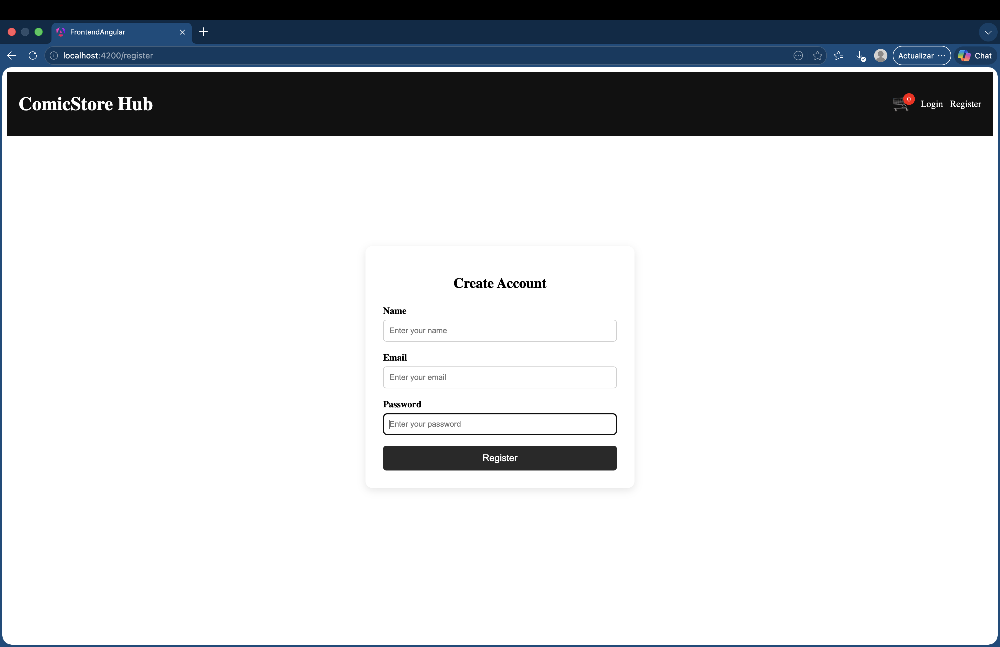
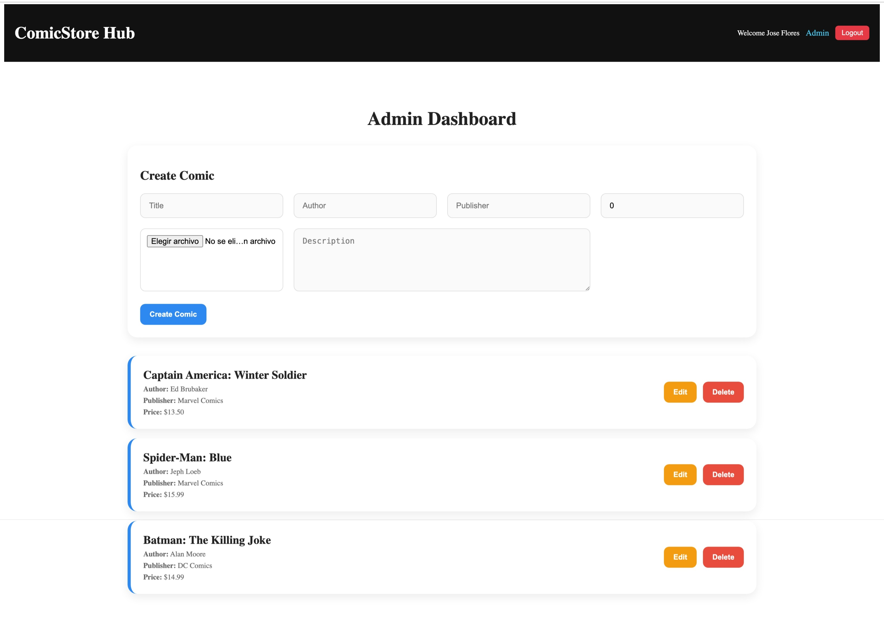
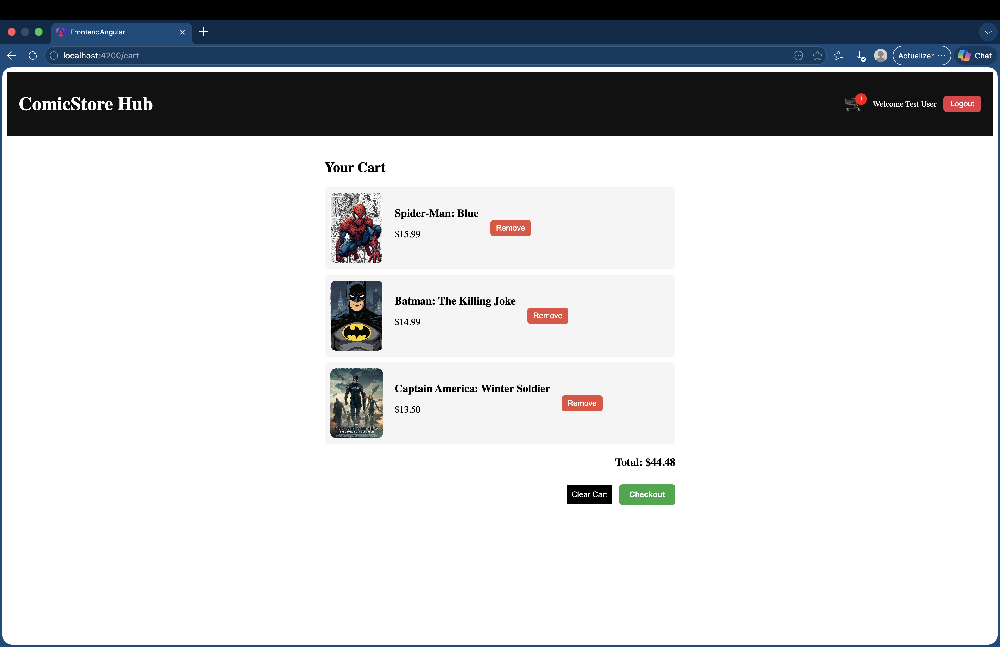
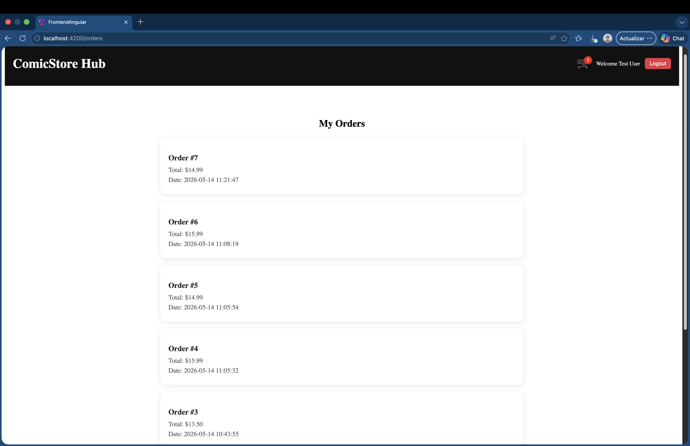

ComicStore Hub

ComicStore Hub is a full-stack e-commerce web application for browsing, managing, and purchasing comic books.

The project includes:

* Angular frontend
* PHP REST API backend
* MySQL database
* Authentication and authorization system
* Admin panel
* Shopping cart and checkout flow
* Order history system

⸻

Features

User Features

* User registration and login
* Persistent session authentication
* Browse comic catalog
* View comic details
* Add comics to cart
* Remove comics from cart
* Checkout system
* Order history page

⸻

Admin Features

* Admin-only protected routes
* Add new comics
* Edit comics
* Delete comics
* Upload comic cover images

⸻

Tech Stack

Frontend

* Angular
* TypeScript
* HTML
* CSS
* RxJS

⸻

Backend

* PHP
* REST API architecture
* Session-based authentication

⸻

Database

* MySQL
* Relational database structure

⸻

Database Tables

* users
* comics
* orders
* order_items

⸻

Authentication System

The application uses:

* PHP sessions
* Role-based authorization
* Protected admin routes
* Angular authentication state management

⸻

Checkout Flow

1. User adds comics to cart
2. User completes checkout
3. Order is stored in MySQL
4. Order items are linked to the order
5. Order history is displayed to the user

⸻

Responsive Design

The application includes responsive layouts for:

* Navigation bar
* Orders page
* Cart page
* General mobile support

⸻

Screenshots

# Screenshots

## Catalog Page

---

## Login Page

---

## Register Page

---

## Admin Dashboard

---

## Shopping Cart

---

## Orders Page

⸻

Installation

Clone Repository

git clone https://github.com/The-JFlores/ComicStore-Hub.git

⸻

Backend Setup

1. Move project folder into XAMPP htdocs
2. Start Apache and MySQL in XAMPP
3. Import the SQL database into phpMyAdmin
4. Configure database connection in:

config/database.php

⸻

Frontend Setup

Navigate to frontend-angular:

cd frontend-angular
npm install
ng serve

⸻

Local URLs

Angular Frontend

http://localhost:4200

PHP Backend

http://localhost/comicstore_hub

⸻

Future Improvements

* Order details page
* Payment gateway integration
* Inventory management
* Email notifications
* Advanced admin analytics

⸻

Author

Jose Olmedo Flores Paniagua